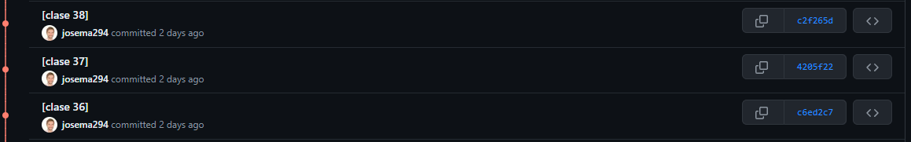

# Spring Framework 6 & Spring Boot 3 desde cero a experto 2024

### Construye aplicaciones web Spring Framework 6 y Spring Boot 3: AOP, JPA, Security JWT, RESTful, AWS EC2, Angular, React


## Descripción

Este repositorio contiene las prácticas y ejercicios del curso [Spring Framework 6 & Spring Boot 3 desde cero a experto 2024](https://www.udemy.com/course/spring-framework-5/) del instructor [Andrés Guzmán](https://www.udemy.com/user/andres-guzman-9/). El curso ha sido actualizado recientemente incluyendo una nueva parte que "sustituye a las antiguas lecciones del curso".

Este repositorio es un compendio en el que he realizado todos los ejercicios que van apareciendo en esta nueva actualiuzacion, y aunque en un 90% son iguales a las resolucioens del instructor, tienen un porcentaje de cosecha propia.

## Objetivo
El objetivo es que pueda servir de referencia, unificando en un repositorio este curso en su parte mas nueva ya que aunque el curso deja el codigo para descargar, disponer de un repositorio de github para tenerlo todo unificado, poder comprobar cosas, o poder trastear libremente aporta ventajas. 

## Estructura del Proyecto
Para la realizacion se ha seguido la siguiente forma de trabajar. 

1. El proyecto esta dividido en carpetas [seccion{I}] , cada una de las cuales corresponde a uno de los proyectos que se crean en el curso. Estos son proyectos maven con su pom individual, por lo que cada uno puede ser ejecutado por separado.
2. Cada ejercicio una vez realizado se commitea con el siguiente patron [Clase {'Aqui el numero de clase que se ha finalizado'}]
3. Puede haber commits que no reflejan directamente una clase, por ejemplo este commit en el que actualizo el README, pero la inmensa mayoria corresponden a clases.
4. La estructura es incremental por lo tando, a cada commit mas avanzado se incluyen cosas nuevas pero sigues teniendo cosas ya hechas en el curso. Si viajas a los primeros commits, te puedes encontrar el proyecto con diferencias, ya que reflejaba la estructuras de como estaba en esas clase. Por ejemplo, cuando solo habia un proyecto en el curso, todo el reposiotrio de git correspondia a este proyecto en los primeros commits, pero cuando se tiene que crear mas proyectos se varia la estructura conteniendo en cada carpeta el suyo propio.
5. Si quieres ver el estado del curso en un momento mas antiguo, lo puedes hacer moviendote por el historial de commits:
   



## Instalación

1. Clona el repositorio:
    ```sh
    git clone https://github.com/josema294/Spring-Framework-6-Spring-Boot-3-desde-cero-a-experto-2024.git
    ```
2. Navega a la carpeta del proyecto:
    ```sh
    cd cursospringboot
    ```
3. Importa el proyecto en tu IDE favorito (IntelliJ, Eclipse, VSCode).
4. Asegúrate de tener configurado Java y Maven/Gradle.
5. Investiga como quieras, usalo de referencia, o muevete a un commit de una clase concreta para ver que se hizo en dicha clase

```sh
#Saca el historial de commits mediante tu programa favorito de git GUI o mediante comandos en terminal
git log
#En el historial de commits revisa la clase a la que quieras ir, por ejemplo la clase 36 (c6ed2c7) con el hash del commit muevete a el
git chechkout c6e2c7


